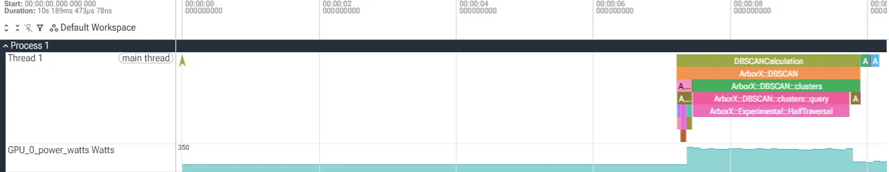
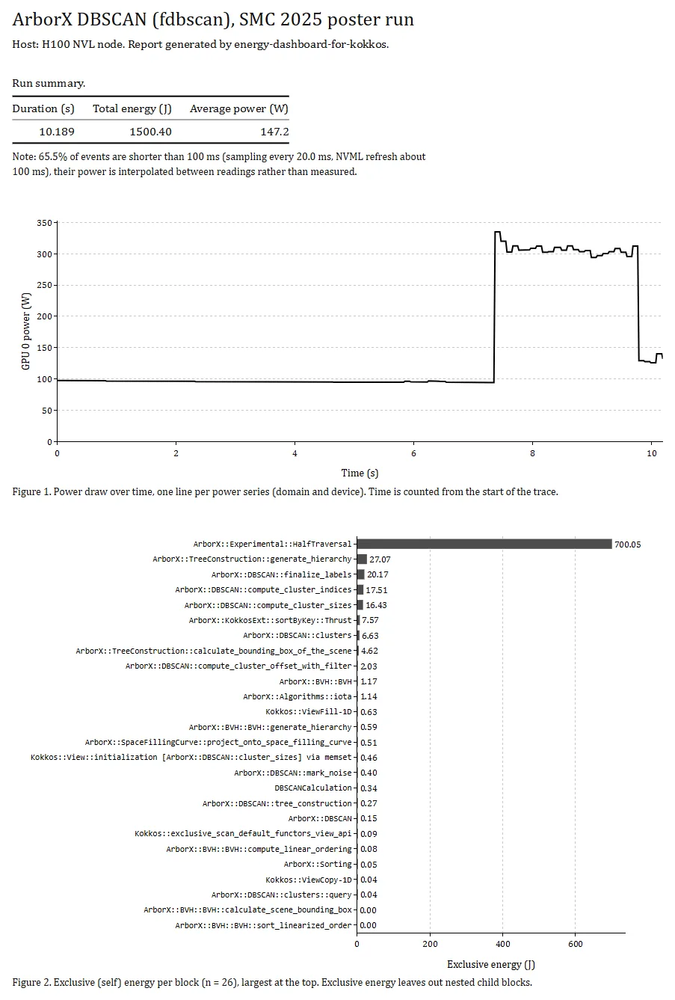

# Tutorial: where does the energy of an ArborX DBSCAN run go?

This tutorial reads a trace recorded on an NVIDIA H100 NVL while
[ArborX](https://github.com/arborx/ArborX) clustered points with DBSCAN. The trace ships in
[`examples/`](../examples), so you need neither a GPU nor Kokkos, only the tool. It takes
about ten minutes.

You will learn to:

- read the terminal table and find the kernel that spends the energy;
- tell inclusive from self energy, and see what the idle row counts;
- know which figures to trust when kernels are short;
- see the run on a timeline, and share it as a single HTML file.

## 1. Get the tool

Clone the repository and build it:

```bash
git clone https://github.com/ethan-puyaubreau/energy-dashboard-for-kokkos.git
cd energy-dashboard-for-kokkos
cargo build --release
```

The commands below call the binary `energy-dashboard-for-kokkos`. After a source build it is
`target/release/energy-dashboard-for-kokkos`. Release archives published after v0.3.0 also
contain `examples/` and this tutorial: run the commands from the extracted directory, with
`./energy-dashboard-for-kokkos`.

## 2. What is in the trace

```text
examples/h100_arborx_fdbscan/
  metadata.json       application, host and Kokkos backend
  events.csv          29 Kokkos regions and kernels, with their start and end times
  power_samples.csv   511 GPU power readings, one every 20 ms
```

The outer region `DBSCANCalculation` wraps the call to ArborX, and ArborX opens a region
around each phase of the algorithm (`USER_REGION`). The kernels (`PARALLEL_FOR`,
`PARALLEL_REDUCE`, `PARALLEL_SCAN`) are recorded by Kokkos itself. The format is described
in [DATA_SPEC.md](../DATA_SPEC.md).

## 3. Analyze it

```bash
energy-dashboard-for-kokkos analyze examples/h100_arborx_fdbscan
```

The tool prints one table, sorted by inclusive energy. Here it is without the rows under
16 J:

| Block / Kernel | Category | Calls | Duration (s) | Energy Incl (J) | Energy Self (J) | Avg Power (W) | % Self |
|----------------|----------|------:|-------------:|----------------:|----------------:|--------------:|-------:|
| DBSCANCalculation | USER_REGION | 1 | 2.681 | 771.83 | 0.34 | 287.9 | 0.0% |
| ArborX::DBSCAN | USER_REGION | 1 | 2.678 | 771.49 | 0.15 | 288.1 | 0.0% |
| ArborX::DBSCAN::clusters | USER_REGION | 1 | 2.450 | 727.62 | 6.63 | 297.0 | 0.4% |
| ArborX::DBSCAN::clusters::query | USER_REGION | 1 | 2.290 | 700.09 | 0.04 | 305.8 | 0.0% |
| ArborX::Experimental::HalfTraversal | PARALLEL_FOR | 1 | 2.290 | 700.05 | 700.05 | 305.8 | 46.7% |
| ArborX::DBSCAN::tree_construction | USER_REGION | 1 | 0.225 | 42.81 | 0.27 | 190.3 | 0.0% |
| ArborX::BVH::BVH | USER_REGION | 1 | 0.222 | 42.55 | 1.17 | 191.5 | 0.1% |
| ArborX::BVH::BVH::generate_hierarchy | USER_REGION | 1 | 0.086 | 28.30 | 0.59 | 328.0 | 0.0% |
| ArborX::TreeConstruction::generate_hierarchy | PARALLEL_FOR | 1 | 0.082 | 27.07 | 27.07 | 331.5 | 1.8% |
| ArborX::DBSCAN::finalize_labels | PARALLEL_FOR | 1 | 0.135 | 20.17 | 20.17 | 149.6 | 1.3% |
| ArborX::DBSCAN::compute_cluster_indices | PARALLEL_FOR | 1 | 0.128 | 17.51 | 17.51 | 137.3 | 1.2% |
| ArborX::DBSCAN::compute_cluster_sizes | PARALLEL_FOR | 1 | 0.129 | 16.43 | 16.43 | 126.9 | 1.1% |
| Idle (outside events) | - | - | 7.234 | 692.35 | 692.35 | 95.7 | 46.1% |
| Total Trace | - | - | 10.189 | 1500.40 | 1500.40 | 147.2 | 100.0% |

Two lines follow the table:

```text
  GPU 0: 1500.40 J, 147.2 W avg

  Note: 65.5% of events are shorter than 100 ms (sampling every 20.0 ms, NVML refresh about 100 ms), their power is interpolated between readings rather than measured.
```

## 4. Follow the energy down the regions

**Energy Incl** counts everything that ran while a block was open, its children included.
Follow it down the nesting:

```text
DBSCANCalculation                                771.83 J
  ArborX::DBSCAN                                 771.49 J
    ArborX::DBSCAN::tree_construction             42.81 J
    ArborX::DBSCAN::clusters                     727.62 J
      ArborX::DBSCAN::clusters::query            700.09 J
        ArborX::Experimental::HalfTraversal      700.05 J   (kernel)
```

The inclusive energy barely drops from one level to the next: the regions do no work
themselves, their kernels do. **Energy Self** says it directly. It removes the children, so
the regions sit near 0 J and the kernels hold the energy. The `% Self` column is based on
it, which is why the rows add up to 100% together with the idle row.

One kernel stands out. `HalfTraversal`, the neighbor search at the heart of DBSCAN, runs for
2.290 s and spends 700.05 J, 46.7% of everything measured. Building the search tree
(`tree_construction`) costs 42.81 J, sixteen times less. If this run had to spend less
energy, the traversal is where to look.

## 5. Compare power, not only energy

**Avg Power** is the inclusive energy divided by the duration. It tells a busy GPU from a
waiting one:

| Block | Duration (s) | Avg Power (W) |
|-------|-------------:|--------------:|
| ArborX::Experimental::HalfTraversal | 2.290 | 305.8 |
| ArborX::DBSCAN::tree_construction | 0.225 | 190.3 |
| ArborX::DBSCAN::finalize_labels | 0.135 | 149.6 |
| Idle (outside events) | 7.234 | 95.7 |

The traversal runs the longest, at more than 300 W, which is why it dominates the energy.
`finalize_labels` runs at half its power: energy is power multiplied by time, and
a short, light kernel stays cheap on both counts.

## 6. Read the idle row

The idle row holds 692.35 J over 7.234 s, 46.1% of the trace. The power readings start
7.2 s before the first Kokkos event: the application had not reached its first region yet,
and the GPU drew 95.7 W on average while it waited. The tool reports that energy instead of
dropping it, so every Joule measured belongs either to a block or to the idle row.

This changes what to compare. The total, 1500.40 J, depends on how long the application
spent before and after its GPU work. The region, 771.83 J for `DBSCANCalculation`, does not.
To compare two runs, two inputs or two GPUs, compare the regions.

The region and the idle row do not make up the whole total. `compute_cluster_sizes`,
`compute_cluster_indices` and a few smaller kernels run after `DBSCANCalculation` has
closed, as top-level blocks, and account for the remaining 36.22 J.

## 7. Know which figures to trust

The note says that 65.5% of the events, 19 of 29, are shorter than 100 ms. The connector
reads the GPU power every 20 ms, but NVML refreshes the value only about every 100 ms. The
power of a shorter event is interpolated between readings rather than measured.

Here, the figures that matter are long: the traversal spans 2.290 s, about 23 NVML
refreshes, and the regions are longer still. They are measured reliably. Treat the rows of
the short kernels as estimates, such as `TreeConstruction::generate_hierarchy` (82 ms)
and its 331.5 W. The
[Limits](../README.md#limits) section of the README explains where the 100 ms comes from.

## 8. See the run on a timeline

```bash
energy-dashboard-for-kokkos analyze examples/h100_arborx_fdbscan --perfetto trace.json
```

Open [ui.perfetto.dev](https://ui.perfetto.dev), then **Open trace file** and pick
`trace.json`. Perfetto reads the file in the browser, it does not upload it.



The nested regions stack on a single track, with the traversal kernel at the bottom, and
the GPU power runs underneath as a counter. The picture explains the idle row: the power
stays around 95 W for the first 7.2 s, then rises above 300 W once the clustering starts.
Press `W` and `S` to zoom, `A` and `D` to pan, and click a slice to read its duration.

## 9. Share an HTML report

```bash
energy-dashboard-for-kokkos analyze examples/h100_arborx_fdbscan --report report.html
```

The report is a single file of about 4.6 MB that opens offline in any browser, since the
chart library is embedded. It shows the totals, the power over time and the self energy of
each block.



`--perfetto` and `--report` can be combined, and `run` accepts them too.

## 10. When kernels are too short: the RTX trace

The second example is a benchmark that launches 56,766 small kernels in 10 s on an
RTX 3080 Ti:

```bash
energy-dashboard-for-kokkos analyze examples/rtx3080ti_energy_bench
```

Three rows of its table, and the note under it:

| Block / Kernel | Category | Calls | Duration (s) | Energy Incl (J) | Energy Self (J) | Avg Power (W) | % Self |
|----------------|----------|------:|-------------:|----------------:|----------------:|--------------:|-------:|
| Reduction | USER_REGION | 1 | 4.000 | 1082.61 | 18.99 | 270.6 | 0.9% |
| MatVec | USER_REGION | 1 | 4.000 | 839.08 | 12.37 | 209.8 | 0.6% |
| daxpy | PARALLEL_FOR | 39882 | 1.835 | 215.53 | 215.53 | 117.5 | 10.0% |

```text
  Note: 99.9% of events are shorter than 100 ms (sampling every 20.4 ms, NVML refresh about 100 ms), their power is interpolated between readings rather than measured.
```

Almost no kernel lasts one NVML refresh. The `daxpy` row still reports 215.53 J over 39882
calls, but it adds up interpolated values, so it remains an estimate. The `MatVec` and
`Reduction` regions last 4 s each, about 40 refreshes: their energy, 839.08 J and
1082.61 J, is the figure to quote. The rule is the same as in step 7: quote blocks much
longer than 100 ms, and treat short kernels as estimates.

## Next steps

- [Reading the report](../README.md#reading-the-report) lists every column and the
  attribution rules.
- [Quick start](../README.md#quick-start) shows how to trace your own application with the
  connector.
